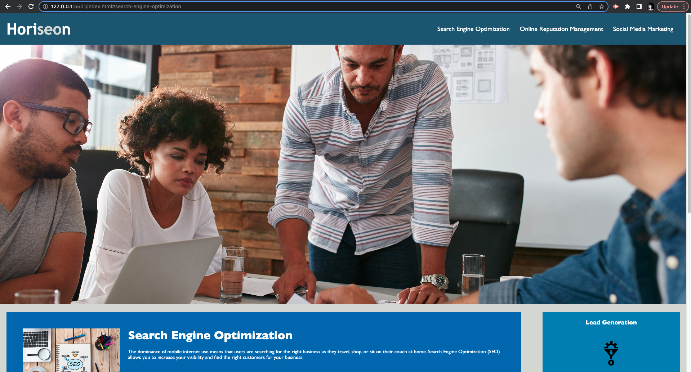

# horiseon-refactoring

 
## Description
 
The Horiseon Marketing Agency required a code refactor for their website's homepage. The focus of this project was to make the code more accessible for screen readers and improve search engine optimization (SEO), as well as cleaning up any code inefficiencies or redundancies. Overall, the main code functions and the webpages original display and styling were not altered, but the code was improved. 
 
 
## Issues Addressed Here

* Provided concise desriptive title element
* Updated source code to meet accessibility standards by adding semantic elements
* Ensured that a logical structure of the HTML elements was in place, independent of styling and positioning
* Updated icon and image elements with accessible alt attributes
* Ensured all heading attributes are in sequential order

 
## Usage

This webpage can be viewed on regular desktop browsers. 
/* ADD IMAGE OF WEBPAGE HERE */

## Project Links and Screenshot
 The following image demonstrates the web application's appearance and functionality:

 
[Link to live webpage](https://olive-provencio-johnson.github.io/horiseon-refactoring/)

 
## Credits
University of Washington Bootcamp Program

 
## License
 
MIT License
---
 